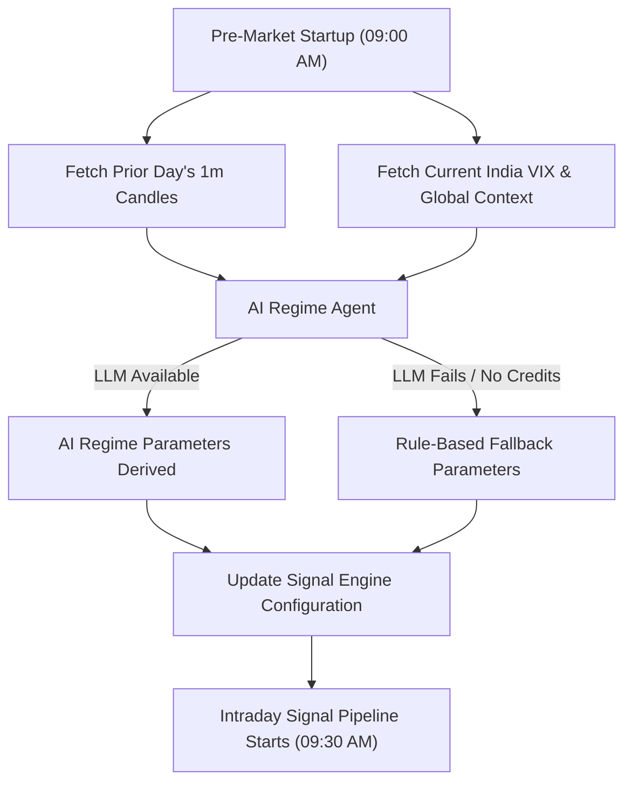

# 🧠 AI Regime Agent Strategy Guide

The **AI Regime Agent** acts as the macro pilot of the ChartEdge trading algorithm. It runs dynamically once per day, pre-market (before 09:15 AM), to analyze the preceding market context, classify the upcoming session's "Market Regime," and override critical strategy parameters.

---

## 🔍 Why It is Needed (The Core Problem)
No single set of indicators or thresholds works in all market environments.
* **In a Strong Trend**: A strategy that buys options on a breakout makes massive gains.
* **In a Range-Bound Chop**: The exact same breakout strategy gets whipped back and forth, losing capital rapidly due to option premium time decay (theta bleed) and bid-ask spreads.

The Regime Agent solves this by dynamically adapting the system's strictness, weights, and trade structures before the first tick of the day occurs.

---

## 📈 System Architecture Flow

---

## 📊 The Four Market Regimes

The Regime Agent classifies the market into one of four distinct states:

| Regime | Description | Underlying Price Pattern |
| :--- | :--- | :--- |
| **`TRENDING_BULLISH`** | Strong directional upward move | Prices make higher highs and higher lows with clean follow-through. |
| **`TRENDING_BEARISH`** | Strong directional downward move | Prices make lower highs and lower lows with clean follow-through. |
| **`RANGE_BOUND_CHOP`** | Consolidating, sideways movement | Prices oscillate within a horizontal band with no clear trend. |
| **`MEAN_REVERTING`** | Directional move followed by sharp rejection | Initial breakouts fail and prices pull back heavily toward the day's open. |

---

## 🛠️ Dynamic Parameter Tuning

Once the regime is classified, the agent dynamically adjusts the following parameters for the day:

### 1. Confluence Entry Threshold
This controls how strictly signals are validated before a trade is entered.
* **Chop/Mean Reverting Days**: Threshold is raised (e.g., **`0.50 – 0.54`**). Entry gates are tightened to filter out fake breakouts.
* **Trending Days**: Threshold is lowered (e.g., **`0.45 – 0.50`**). Entry gates are opened to catch trends early.
* **Volatility Adjustment**: If VIX is high (>20), we add **`+0.03`** to the threshold for extra safety. If VIX is low (<13), we subtract **`0.02`**.

### 2. Indicator Weights (Sums to 1.0)
The agent shifts focus between trend-following indicators and mean-reversion indicators:
* **On Trend Days**: Boosts trend-following indicators like **MACD** (`0.22`) and **Supertrend** (`0.26`); reduces **RSI** (`0.12`).
* **On Chop Days**: Boosts oscillation indicators like **RSI** (`0.22`) and **VWAP** (`0.24`); reduces **Supertrend** (`0.14`).

### 3. Option Strategy Selection
Based on the expected regime, the agent swaps underlying option structures:
* **Trending (Normal VIX)**: `DEBIT_SPREAD` (Buying ATM/ITM, selling further OTM leg to cap costs).
* **Trending (Low VIX)**: `RATIO_BACKSPREAD` (Selling 1 ITM option, buying 2 OTM options for explosive moves).
* **Range Chop**: `IRON_CONDOR` or `SHORT_STRANGLE` (Selling premium from range extremes).
* **Mean Reverting**: `CREDIT_SPREAD` (Selling ATM/ITM leg, buying OTM protection to fade moves).

### 4. Stop Loss ATR Multiplier
* **Low Volatility**: Squeezes stop-losses tighter (**`1.0x – 1.2x ATR`**).
* **High Volatility**: Widens stop-losses (**`1.5x – 2.0x ATR`**) to give the position breathing room and avoid premature stopouts from spikes.

### 5. Theta Timeout
Controls how quickly the engine exits a stale option trade:
* **Trend Days**: Hold longer (**75–90 minutes**) to let winners run.
* **Chop Days**: Exit fast (**30–45 minutes**) if the trade does not move, preventing time-decay from eating the premium.

---

## 🔒 Safety Gates & Event Gating

The agent automatically overrides settings to protect capital during high-risk scenarios:

> [!WARNING]
> **VIX Panic Cutoff**: If India VIX is $\ge 22$, the market is in extreme fear. Spreads widen and option buying loses expectancy. The agent **blocks all option buying unconditionally** to prevent premium crush.

> [!IMPORTANT]
> **Avoid First 30 Minutes**: If the pre-market gap is $>0.5\%$, the prior day had high volatility, or VIX $>17$, the agent forces the system to stay flat until **09:45 AM**, avoiding opening traps.

> [!NOTE]
> **Macro Event Gating**: Near major announcements, the confluence threshold is automatically raised and stop-losses are widened:
> * **Union Budget Day**: Threshold $+0.04$
> * **RBI MPC Decision / Fed FOMC**: Threshold $+0.02 \text{ to } +0.03$

---

## 📝 Code Implementation Reference
The Regime Agent consists of two core components:
1. **AI Framework ([regime_agent.py](file:///Users/nithish-prabhu/Downloads/intra-day/services/chartedge_core/regime_agent.py))**: Formulates the prompt containing previous day OHLCV candles, VIX level, pre-market gap, and global news feeds, then feeds it to the LLM. It contains the deterministic rule-based fallback if the API is offline.
2. **Runtime Integration ([indstocks.py](file:///Users/nithish-prabhu/Downloads/intra-day/services/chartedge_core/indstocks.py#L164-L220))**: Executes the Regime Agent pre-market, parses the outputs, and registers the thresholds and weights into the execution engine.
